# **CreditFlow AI: Agentic Risk Assessment System**

<div align="center">

**An enterprise-grade multi-agent system designed to automate financial risk assessment for the informal economy.**

[Architecture] • [Key Features] • [Installation] • [The "Why"]

</div>

## **📋 Executive Summary**

**CreditFlow AI** is a stateful multi-agent system built to modernize the credit evaluation process in emerging markets (specifically targeting the Dominican Republic's financial sector).

Unlike traditional rule-based automations, CreditFlow AI uses **Cognitive Agents** to analyze unstructured data (bank statements, informal business letters, social media footprints) and calculate a dynamic **Internal Risk Score (IRS)**.

The system reduces initial credit assessment time from **24 hours to < 2 minutes**, maintaining a deviation of less than 5% compared to senior human analysts.

## **🏗️ System Architecture**

The system is orchestrated using **LangGraph** to manage cyclical state and persistence. It follows a "Plan-and-Execute" pattern with parallel processing for data gathering.

```mermaid
graph TD  
    Start([Inbound Request]) --> Triage[👮 Triage Agent]  
    Triage -->|Qualified| DocProc[📄 Document Processor]  
    Triage -->|Disqualified| End([❌ Auto-Rejection])  
      
    DocProc --> ParStart((Parallel Exec))  
      
    subgraph Analysis Layer  
        ParStart --> FinAgent[📊 Financial Analyst Agent]  
        ParStart --> OsintAgent[🕵️ OSINT Researcher Agent]  
    end  
      
    FinAgent --> Agg((Aggregation))  
    OsintAgent --> Agg  
      
    Agg --> Scorer[⚖️ Risk Scorer Agent]  
    Scorer --> Underwriter[👨‍💼 Underwriter Agent]  
      
    Underwriter -->|Low Confidence| Human([⚠️ Human-in-the-Loop])  
    Underwriter -->|High Confidence| Final([✅ Final Decision])
```



## **🤖 The Agent Team**

| Agent Role | Responsibility & Logic | Tools / Models |
| :---- | :---- | :---- |
| **👮 Node: Triage** | Acts as the gatekeeper. Validates basic eligibility (age, location, minimum income requested) before spending compute resources on deeper analysis. | GPT-4o-mini |
| **📄 Node: Document Processor** | OCR and extraction. Converts unstructured PDFs (Bank Statements, Employment Letters) into structured JSON. Handles format validation. | GPT-4o Vision Unstructured.io |
| **🕵️ Node: OSINT Researcher** | "Street Verification". Searches specifically for digital footprints of informal businesses (Instagram, Google Maps) to validate existence and activity. | SerpAPI Tavily |
| **📊 Financial Analyst** | The "Math Engine". Calculates debt-to-income ratios, detects cash flow patterns, and flags inconsistencies between declared vs. actual income. | Claude 3.5 Sonnet Pandas |
| **⚖️ Node: Risk Scorer** | Applies the **IRS Algorithm**. Weights 'Willingness to Pay' (Moral) vs. 'Ability to Pay' (Capacity). Generates the numeric score. | Python Logic |
| **👨‍💼 Node: Underwriter** | Final decision maker. Reviews the Score + OSINT evidence. Generates a justified "Approval Memo" or "Rejection Notice". | Claude 3.5 Sonnet |

## **🧠 Internal Risk Score (IRS) Logic**

The core differentiator of CreditFlow AI is its ability to quantify qualitative data.

* **Capacity (40%):** (Net Income - Bureau Debt - Proposed Installment) / Net Income  
* **Stability (30%):** Weighted score based on months in current residence + employment longevity.  
* **Morality (30%):** 100 - (20 * financial_alerts) - (10 * interview_inconsistencies)

## **🛠️ Tech Stack**

* **Orchestration:** [LangGraph](https://github.com/langchain-ai/langgraph) (State management, Cyclic flows).  
* **Language:** Python 3.10+ (Type-safe).  
* **LLMs:** Anthropic Claude 3.5 Sonnet (Reasoning) & OpenAI GPT-4o (Extraction).  
* **Integration:** n8n (Webhooks, WhatsApp API triggers).  
* **Database:** PostgreSQL (Supabase) for Checkpoint persistence.  
* **Search:** SerpAPI (Google/Social Media lookup).

## **🚀 Installation & Setup**

### **Prerequisites**

* Python 3.10+  
* WSL2 (Ubuntu) or Mac/Linux environment  
* API Keys: OpenAI, Anthropic, Tavily/SerpAPI

### **Steps**

1. **Clone the repository:**  
   ```bash
   git clone [https://github.com/ibernabel/financial-risk-agent-graph.git](https://github.com/ibernabel/financial-risk-agent-graph.git)  
   cd financial-risk-agent-graph
   ```

2. **Set up Virtual Environment:**  
   ```bash
   python -m venv venv  
   source venv/bin/activate
   ```

3. **Install Dependencies:**  
   ```bash
   pip install -r requirements.txt
   ```

4. **Environment Variables:**  
   ```bash
   Create a .env file based on .env.example:  
   ANTHROPIC_API_KEY=sk-...  
   OPENAI_API_KEY=sk-...  
   TAVILY_API_KEY=tvly-...  
   DATABASE_URL=postgresql://...
   ```

5. **Run the Graph (Local Mode):**  
   ```bash
   python src/main.py
   ```

## **💻 Usage Example**

```python
from src.graph import app

# Initial State: A new credit application via WhatsApp
initial_state = {  
    "applicant_id": "8492-XJ",  
    "declared_income": 45000.00,  
    "documents": ["/tmp/estado_cuenta_bhd.pdf"],  
    "business_name": "Salón de Belleza Glamour",  
    "messages": []  
}

# Stream the graph execution  
for event in app.stream(initial_state):  
    for key, value in event.items():  
        print(f"Agent {key} finished processing...")  
        print(f"Current Risk Score: {value.get('risk_score', 'Pending')}")
```

## **🛡️ Security & Privacy**

* **Data Anonymization:** PII (Personal Identifiable Information) is masked before being sent to external LLM providers using regex pre-processors.  
* **Compliance:** Designed following principles of Dominican Law 172-13 on personal data protection.  
* **Audit Logs:** Every state transition is checkpointed in Postgres for regulatory audit trails.

## **🔮 Roadmap**

* [ ] Integration with TransUnion (Bureau) API.  
* [ ] "Human-in-the-loop" UI using LangSmith for manual override of edge cases.  
* [ ] WhatsApp Voice Note transcription and sentiment analysis.

<div align="center">

**Built by [Idequel Bernabel](https://github.com/ibernabel)**

*AI Solutions Architect | Transforming Financial Operations*

</div>