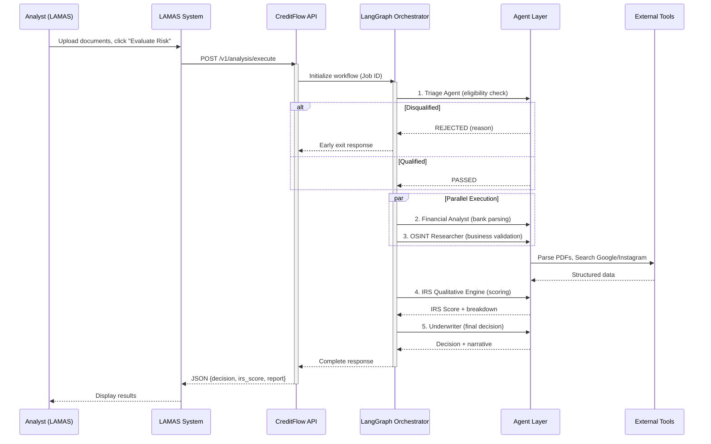
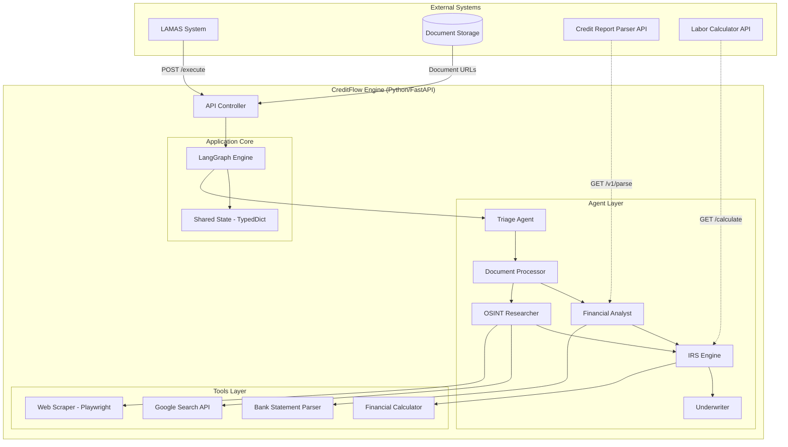
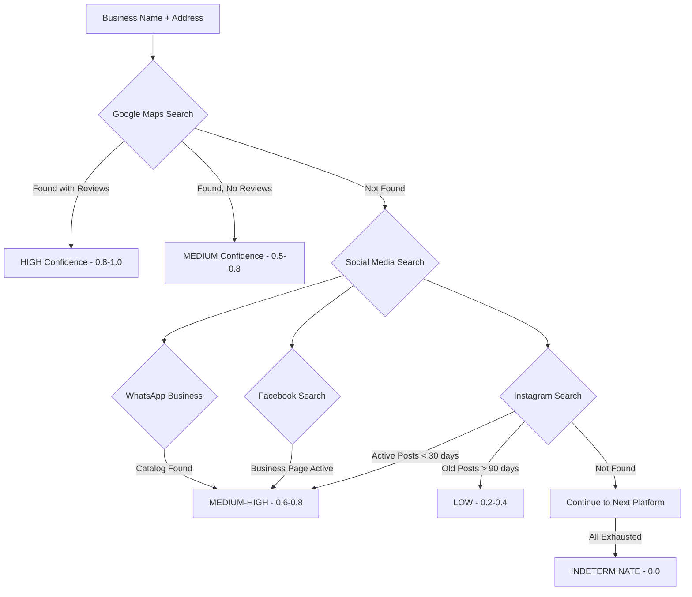

# CreditFlow AI - Product Requirements Document (PRD)

**Version:** 2.0 (Final)  
**Author:** Idequel Bernabel  
**Date:** February 4, 2026  
**Status:** Draft for Review

---

## 1. Executive Summary

### Problem Statement

Financial institutions in the Dominican Republic face a critical bottleneck in credit evaluation for the informal economy and emerging middle class. Current processes suffer from:

1. **24-48 hour evaluation times** causing client attrition and high acquisition costs
2. **Inconsistent decision-making** due to non-codified analyst intuition
3. **Systematic rejection of solvent informal workers** invisible to traditional systems
4. **Undetected fraud patterns** in manual document review

### Proposed Solution

**CreditFlow AI** is a headless microservice API that orchestrates specialized AI agents to perform forensic credit analysis. The system:

- Receives applicant data and documents via REST API from LAMAS (Loan Management System)
- Executes parallel analysis using specialized agents (Triage, OSINT, Financial, IRS)
- Returns a structured JSON with **Internal Risk Score (IRS)**, decision, and narrative justification

### Success Criteria

| KPI                       | Target                                                   | Measurement                       |
| ------------------------- | -------------------------------------------------------- | --------------------------------- |
| Time-to-Decision          | < 2 minutes (from 24-48 hours)                           | API response time logging         |
| Decision Accuracy         | < 10% deviation from senior analyst committee            | A/B testing with historical cases |
| Bank Statement Parsing    | 95% accuracy on 3 priority banks                         | Test suite with 50 documents      |
| OSINT Business Validation | 70% success for informal businesses with social presence | Test set validation               |
| Extraction Precision      | 95% for name, salary, employer RNC                       | Unit tests per bank format        |

---

## 2. User Experience & Functionality

### User Personas

#### Persona 1: Senior Credit Analyst ("El Experto Abrumado")

- **Profile:** 10+ years experience, spends 80% of time on data entry and basic validations
- **Need:** Tool that handles "dirty work" (PDF reading, Google searches) so they can focus on borderline cases and interviews
- **Benefit:** Reviews AI-generated reports instead of raw documents

#### Persona 2: Operations Manager ("El Guardián de la Mora")

- **Profile:** Responsible for portfolio profitability and fraud prevention
- **Need:** Full traceability of WHY each credit was approved for audit and policy adjustment
- **Benefit:** Receives Chain-of-Thought narrative explaining each score component

### User Stories

| ID    | Story                                                                                                                    | Acceptance Criteria                                                    |
| ----- | ------------------------------------------------------------------------------------------------------------------------ | ---------------------------------------------------------------------- |
| US-01 | As an Analyst, I want to upload documents and receive an automated risk assessment so I can focus on decision-making     | System returns IRS score + decision within 60 seconds                  |
| US-02 | As an Analyst, I want the system to detect hidden debt patterns so I avoid approving over-indebted clients               | "Fast Withdrawal" and "Informal Lender" patterns flagged automatically |
| US-03 | As an Analyst, I want OSINT validation of informal businesses so I can approve legitimate cases invisible to Google Maps | Instagram/Facebook activity search with Digital Veracity Score         |
| US-04 | As a Manager, I want a detailed narrative report explaining each score component so I can audit decisions                | Report includes evidence citations and penalty explanations            |
| US-05 | As a Manager, I want escalation to human review for low-confidence cases so the system doesn't auto-approve risky loans  | Cases with confidence <85% routed to manual review                     |

### Non-Goals (Out of Scope for MVP)

- [ ] Automatic fund disbursement (LBTR transfer)
- [ ] Legal collection management or automated collection calls
- [ ] Complex financial statement analysis (Balance Sheet/P&L) for corporations
- [ ] WhatsApp voice note transcription (Roadmap v2.0)
- [ ] TransUnion API integration (use PDF parser instead)

---

## 3. System Architecture

### High-Level Flow



### Component Architecture



---

## 4. Agent Specifications

### Agent 1: Triage Agent (El Portero)

**Purpose:** First-line filter to reject obviously ineligible applicants before consuming compute resources.

#### Input

| Field                      | Type    | Required | Description                  |
| -------------------------- | ------- | -------- | ---------------------------- |
| applicant.age              | integer | Yes      | Calculated from DOB          |
| applicant.declared_address | string  | Yes      | Province/municipality        |
| applicant.declared_salary  | decimal | Yes      | Monthly income in DOP        |
| loan.requested_amount      | decimal | Yes      | Loan amount in DOP           |
| loan.product_type          | enum    | Yes      | PERSONAL_LOAN, SAVINGS, etc. |

#### Business Rules

| Rule ID | Condition                                      | Action                                          |
| ------- | ---------------------------------------------- | ----------------------------------------------- |
| TR-01   | age < 18 OR age > 65                           | REJECT: "Edad fuera de rango permitido (18-65)" |
| TR-02   | declared_address.province NOT IN allowed_zones | REJECT: "Zona geográfica no cubierta"           |
| TR-03   | declared_salary < minimum_wage_by_sector       | REJECT: "Ingreso insuficiente"                  |
| TR-04   | requested_amount < 5,000 OR > 100,000 DOP      | REJECT: "Monto fuera de rango (DOP 5K-100K)"    |
| TR-05   | All rules pass                                 | CONTINUE to next agent                          |

> [!IMPORTANT]
> **Zone Configuration:** For `PERSONAL_LOAN` product, only Santo Domingo province is allowed. For `SAVINGS` product, nationwide coverage applies. This is configurable per product.

#### Required Tool: Minimum Wage Fetcher

```python
def get_minimum_wage(company_size: str) -> Decimal:
    """
    Fetch current minimum wage from official source.

    Args:
        company_size: "large" | "medium" | "small" | "micro"

    Returns:
        Minimum monthly wage in DOP

    Source: Ministerio de Trabajo RD
    """
```

#### Output

```json
{
  "status": "PASSED" | "REJECTED",
  "rejection_reason": "string | null",
  "eligibility_flags": ["FLAG_1", "FLAG_2"]
}
```

---

### Agent 2: Document Processor (OCR Node)

**Purpose:** Extract and classify uploaded documents, validate quality, prepare for downstream agents.

#### Supported Document Types

| Type             | Classification Keywords                     | Output                      |
| ---------------- | ------------------------------------------- | --------------------------- |
| `bank_statement` | "Estado de Cuenta", bank logos              | Transactions JSON           |
| `labor_letter`   | "Carta de Trabajo", "Certificación Laboral" | Employment JSON             |
| `id_card`        | "Cédula", JCE format                        | Identity JSON               |
| `credit_report`  | "DataCrédito", "TransUnion"                 | Routed to Credit Parser API |

#### Quality Validation

| Check             | Threshold               | Action on Failure           |
| ----------------- | ----------------------- | --------------------------- |
| OCR Confidence    | < 70%                   | Flag: `DOCUMENT_ILLEGIBLE`  |
| Page Completeness | Missing pages detected  | Flag: `DOCUMENT_INCOMPLETE` |
| Date Freshness    | Statement > 90 days old | Flag: `DOCUMENT_OUTDATED`   |

#### Bank Statement Parser (Priority Banks)

| Bank          | Format Support | Parser Status |
| ------------- | -------------- | ------------- |
| Banco Popular | Native PDF     | MVP Priority  |
| Banco BHD     | Native PDF     | MVP Priority  |
| Banreservas   | Native PDF     | MVP Priority  |
| Others        | TBD            | Post-MVP      |

---

### Agent 3: OSINT Researcher (El Detective Digital)

**Purpose:** Validate business existence and activity using open-source intelligence when traditional sources (Google Maps, RNC registry) fail.

#### Search Strategy



#### Digital Veracity Score (DVS)

| Factor               | Weight | Scoring Criteria                           |
| -------------------- | ------ | ------------------------------------------ |
| Google Maps Presence | 30%    | Found=1.0, Not Found=0.0                   |
| Reviews Count        | 15%    | >10=1.0, 5-10=0.7, 1-4=0.4, 0=0.0          |
| Instagram Activity   | 25%    | Posts in last 30d=1.0, 90d=0.6, None=0.0   |
| Facebook Page        | 15%    | Active=1.0, Inactive=0.4, None=0.0         |
| Name Consistency     | 15%    | Exact match=1.0, Partial=0.5, Mismatch=0.0 |

> [!NOTE]
> **TBD:** Define minimum post age threshold for business validation (e.g., posts within last 30 days vs 90 days). Recommend starting with 90 days for MVP and tightening based on fraud analysis.

#### Tools Required

| Tool                        | Purpose                           | Implementation   |
| --------------------------- | --------------------------------- | ---------------- |
| Google Search API (SerpAPI) | Maps and business search          | API integration  |
| Playwright Scraper          | Instagram public profile scraping | Headless browser |
| Sherlock (optional)         | Username search across platforms  | CLI wrapper      |

---

### Agent 4: Financial Analyst (The Cruncher)

**Purpose:** Parse bank statements, calculate cash flow metrics, detect risk patterns.

#### Transaction Extraction Schema

```json
{
  "bank_name": "string",
  "account_number": "string (masked)",
  "period": {
    "start_date": "YYYY-MM-DD",
    "end_date": "YYYY-MM-DD"
  },
  "transactions": [
    {
      "date": "YYYY-MM-DD",
      "description": "string",
      "amount": "decimal",
      "type": "CREDIT" | "DEBIT",
      "balance": "decimal",
      "category": "SALARY" | "TRANSFER" | "PAYMENT" | "OTHER"
    }
  ],
  "summary": {
    "total_credits": "decimal",
    "total_debits": "decimal",
    "average_balance": "decimal",
    "salary_deposits": ["decimal array"],
    "detected_payroll_day": "integer (1-31)"
  }
}
```

#### Risk Pattern Detection

| Pattern ID | Name                 | Detection Logic                                       | Risk Level |
| ---------- | -------------------- | ----------------------------------------------------- | ---------- |
| FIN-01     | Fast Withdrawal      | Withdrawal >90% of salary within 24h of deposit       | HIGH       |
| FIN-02     | Informal Lender      | Recurring transfers to same person with round amounts | CRITICAL   |
| FIN-03     | NSF/Overdraft        | Multiple insufficient fund flags                      | MEDIUM     |
| FIN-04     | Salary Inconsistency | >20% variance between declared vs actual deposits     | HIGH       |
| FIN-05     | Multiple Accounts    | Transfers suggesting hidden accounts                  | MEDIUM     |

#### Credit Bureau Integration

**Tool:** [transunion-credit-report-converter-to-json](https://github.com/ibernabel/transunion-credit-report-converter-to-json)

```python
# API Call to Credit Parser Service
async def parse_credit_report(pdf_url: str) -> CreditReport:
    """
    POST /v1/parse
    Body: file (PDF upload)
    Response: See expected_output_schema.json
    """
```

**Expected Output Fields:**

- `personal_data`: Name, DOB, addresses, phones
- `score`: TransUnion score + factors
- `summary_open_accounts`: Active accounts by subscriber
- `details_open_accounts`: Full account history with behavior vectors

---

### Agent 5: IRS Qualitative Engine (El Corazón)

**Purpose:** Apply business rules to generate the Internal Risk Score (0-100) with full explainability.

#### Scoring Matrix

**Base Score: 100 points** (deductions applied)

| Variable            | Max Points | Weight |
| ------------------- | ---------- | ------ |
| A. Credit History   | 25         | 25%    |
| B. Payment Capacity | 25         | 25%    |
| C. Stability        | 15         | 15%    |
| D. Collateral       | 15         | 15%    |
| E. Payment Morality | 20         | 20%    |

#### Variable A: Credit History (25 pts)

| Condition                        | Deduction | Flag                  |
| -------------------------------- | --------- | --------------------- |
| Bureau score < 600               | -15       | `POOR_CREDIT_HISTORY` |
| Bureau score 600-700             | -7        | `FAIR_CREDIT_HISTORY` |
| Recent inquiries > 5 in 6 months | -5        | `EXCESSIVE_INQUIRIES` |
| Active delinquencies             | -10       | `ACTIVE_DELINQUENCY`  |
| Trend: debt increasing           | -3        | `RISING_DEBT`         |

#### Variable B: Payment Capacity (25 pts)

| Condition                                                                   | Deduction | Flag                    |
| --------------------------------------------------------------------------- | --------- | ----------------------- |
| (Net Income - Expenses - Bureau Debt - Proposed Payment) / Net Income < 10% | -20       | `CRITICAL_CASH_FLOW`    |
| Same ratio 10-20%                                                           | -10       | `TIGHT_CASH_FLOW`       |
| Salary < Minimum Wage + 10%                                                 | -5        | `LOW_INCOME`            |
| Dependents > 3 AND Salary < 35,000 DOP                                      | -10       | `HIGH_DEPENDENCY_RATIO` |

#### Variable C: Stability (15 pts)

| Condition                            | Deduction | Flag                    |
| ------------------------------------ | --------- | ----------------------- |
| Employment < 3 months                | -10       | `PROBATION_PERIOD`      |
| Employment 3-12 months               | -5        | `SHORT_TENURE`          |
| Residence < 6 months                 | -5        | `RECENT_MOVE`           |
| Address mismatch (declared vs bills) | -5        | `ADDRESS_INCONSISTENCY` |

#### Variable D: Collateral (15 pts)

| Condition                              | Deduction | Flag                     |
| -------------------------------------- | --------- | ------------------------ |
| No assets (vehicle/property)           | -3        | `NO_ASSETS`              |
| Severance (prestaciones) < 20% of loan | -5        | `INSUFFICIENT_GUARANTEE` |

**Severance Calculator Integration:**

```
Tool: https://calculo.mt.gob.do/
Input: Start Date, End Date, Salary
Output: Total prestaciones (cesantía + preaviso + vacaciones)
```

#### Variable E: Payment Morality (20 pts)

| Condition                                            | Deduction | Flag                       |
| ---------------------------------------------------- | --------- | -------------------------- |
| Fast Withdrawal pattern detected                     | -5        | `FAST_WITHDRAWAL`          |
| Informal lender pattern detected                     | -15       | `INFORMAL_LENDER_DETECTED` |
| Interview inconsistency (says no kids, pays tuition) | -10       | `DATA_INCONSISTENCY`       |
| Address mismatch (declared vs consumption zone)      | -10       | `LOCATION_MISMATCH`        |

#### Output

```json
{
  "irs_score": 85,
  "irs_breakdown": {
    "credit_history": 20,
    "payment_capacity": 20,
    "stability": 15,
    "collateral": 10,
    "payment_morality": 20
  },
  "flags": ["FAST_WITHDRAWAL"],
  "deductions_applied": [
    {
      "variable": "payment_morality",
      "rule": "Fast Withdrawal pattern on 2026-01-15, 2026-01-30",
      "points_deducted": 5
    }
  ],
  "narrative": "El solicitante muestra un perfil financiero sólido con score de buró 770. Se detectó patrón de Retiro Rápido el día 15 y 30 del mes, penalizando 5 puntos en Moral de Pago. La antigüedad laboral de 6 años y prestaciones acumuladas de RD$266,861.31 compensan parcialmente este riesgo."
}
```

---

### Agent 6: Underwriter (El Decisor)

**Purpose:** Make final credit decision based on IRS score and confidence level.

#### Decision Matrix

| IRS Score | Confidence | Decision                  | Action                              |
| --------- | ---------- | ------------------------- | ----------------------------------- |
| 85-100    | ≥85%       | `APPROVED`                | Auto-approve, generate offer letter |
| 85-100    | <85%       | `APPROVED_PENDING_REVIEW` | Route to human for confirmation     |
| 60-84     | Any        | `MANUAL_REVIEW`           | Full human review required          |
| <60       | Any        | `REJECTED`                | Auto-reject with reason             |

> [!IMPORTANT]
> **Human Override:** Senior analysts can override any AI decision. All overrides are logged with justification for audit purposes.

#### High-Amount Threshold

| Loan Amount  | Required Flow                      |
| ------------ | ---------------------------------- |
| ≤ 50,000 DOP | Standard flow                      |
| > 50,000 DOP | Always requires human confirmation |

---

## 5. API Specification

### Endpoint: POST /api/v1/analysis/execute

#### Request

```json
{
  "case_id": "REQ-2026-001",
  "applicant": {
    "id": "001-XXXXXXX-X",
    "full_name": "Juan Pérez",
    "date_of_birth": "1988-12-30",
    "declared_salary": 35000.0,
    "declared_address": "Calle 4, Ensanche Ozama, SDE",
    "declared_employer": "Empresa XYZ SRL",
    "dependents_count": 2
  },
  "loan": {
    "requested_amount": 75000.0,
    "term_months": 24,
    "product_type": "PERSONAL_LOAN"
  },
  "documents": [
    {
      "type": "bank_statement",
      "bank_name": "bhd",
      "url": "https://storage.example.com/cases/001/bhd_stmt.pdf"
    },
    {
      "type": "labor_letter",
      "url": "https://storage.example.com/cases/001/carta.pdf"
    },
    {
      "type": "credit_report",
      "url": "https://storage.example.com/cases/001/buro.pdf"
    }
  ],
  "config": {
    "force_reanalysis": false,
    "skip_osint": false
  }
}
```

#### Response (Success)

```json
{
  "status": "completed",
  "execution_time_ms": 45000,
  "case_id": "REQ-2026-001",
  "result": {
    "decision": "APPROVED_WITH_CONDITIONS",
    "irs_score": 78,
    "confidence": 0.82,
    "risk_level": "MEDIUM",
    "suggested_amount": 50000.0,
    "suggested_term": 18,
    "flags": [
      "FAST_WITHDRAWAL: Detected on 2026-01-15, 2026-01-30",
      "HIGH_AMOUNT: Requires senior approval"
    ],
    "irs_breakdown": {
      "credit_history": 22,
      "payment_capacity": 18,
      "stability": 15,
      "collateral": 8,
      "payment_morality": 15
    },
    "osint_validation": {
      "business_found": true,
      "digital_veracity_score": 0.72,
      "sources_checked": ["google_maps", "instagram"]
    },
    "reasoning": "El solicitante presenta un perfil de riesgo MEDIO. Score de buró 770 indica buen historial. Se detectó patrón de Retiro Rápido indicando posible presión de deudas. El negocio 'Salón Glamour' fue validado en Instagram con actividad reciente (hace 5 días). Prestaciones acumuladas: RD$266,861.31. RECOMENDACIÓN: Aprobar monto reducido de RD$50,000 en plazo de 18 meses."
  },
  "audit_trail": {
    "triage_passed": true,
    "documents_processed": 3,
    "agents_executed": [
      "triage",
      "doc_processor",
      "financial",
      "osint",
      "irs",
      "underwriter"
    ],
    "total_llm_calls": 12,
    "total_tool_calls": 8
  }
}
```

#### Error Responses

| Code | Condition                  | Response                                                    |
| ---- | -------------------------- | ----------------------------------------------------------- |
| 400  | Invalid request payload    | `{"error": "validation_error", "details": [...]}`           |
| 422  | Document processing failed | `{"error": "document_error", "flag": "DOCUMENT_ILLEGIBLE"}` |
| 500  | Internal processing error  | `{"error": "internal_error", "trace_id": "xxx"}`            |
| 504  | Timeout (>60s)             | `{"error": "timeout", "partial_result": {...}}`             |

---

## 6. Technical Requirements

### Technology Stack

| Component        | Technology            | Justification                            |
| ---------------- | --------------------- | ---------------------------------------- |
| Runtime          | Python 3.11+          | LangGraph native, async support          |
| API Framework    | FastAPI               | Async, Pydantic validation, OpenAPI docs |
| Asynchronous     | Python Asyncio        | Native async support                     |
| Schema           | Python Pydantic       | Data validation, serialization           |
| Package Manager  | Python UV             | Fast dependency management               |
| Orchestration    | LangGraph             | Stateful cyclic workflows, checkpointing |
| LLM (Reasoning)  | Claude 3.5 Sonnet     | Best for complex financial analysis      |
| LLM (Extraction) | GPT-4o Vision         | Superior OCR and table extraction        |
| Web Scraping     | Playwright            | Headless browser for social media        |
| Search API       | SerpAPI / Tavily      | Google Maps, social media search         |
| Database         | PostgreSQL (Supabase) | Checkpoint persistence, audit logs       |

### Project Structure

```
/creditflow-engine
├── app/
│   ├── api/
│   │   ├── endpoints.py          # FastAPI routes
│   │   ├── models.py             # Pydantic request/response schemas
│   │   └── dependencies.py       # Auth, rate limiting
│   ├── core/
│   │   ├── config.py             # Environment configuration
│   │   ├── graph.py              # LangGraph definition
│   │   └── state.py              # TypedDict state schema
│   ├── agents/
│   │   ├── triage/
│   │   │   ├── node.py           # Agent logic
│   │   │   ├── prompt.py         # System prompt
│   │   │   └── rules.py          # Business rules
│   │   ├── osint/
│   │   │   ├── node.py
│   │   │   ├── prompt.py
│   │   │   └── tools.py          # Scraper, search tools
│   │   ├── financial/
│   │   │   ├── node.py
│   │   │   ├── prompt.py
│   │   │   └── parsers/          # Bank-specific parsers
│   │   │       ├── bhd.py
│   │   │       ├── popular.py
│   │   │       └── banreservas.py
│   │   ├── irs_engine/
│   │   │   ├── node.py
│   │   │   ├── prompt.py
│   │   │   ├── scoring.py        # IRS algorithm
│   │   │   └── rules.py          # Deduction rules
│   │   └── underwriter/
│   │       ├── node.py
│   │       └── prompt.py
│   └── tools/
│       ├── labor_calculator.py   # Ministerio de Trabajo integration
│       ├── credit_parser.py      # TransUnion parser API client
│       ├── minimum_wage.py       # Salary lookup
│       └── document_validator.py # OCR quality checks
├── tests/
│   ├── unit/
│   ├── integration/
│   └── fixtures/                 # Sample documents
├── Dockerfile
├── docker-compose.yml
├── pyproject.toml
├── .env.example
└── README.md
```

### Non-Functional Requirements

| Requirement        | Specification                                               |
| ------------------ | ----------------------------------------------------------- |
| **Latency**        | End-to-end < 60 seconds (excluding slow external APIs)      |
| **Availability**   | 99.5% uptime during business hours (8am-6pm AST)            |
| **Scalability**    | Handle 100 concurrent requests via horizontal scaling       |
| **Security**       | API Key auth (X-API-KEY), HTTPS only, PII masking in logs   |
| **Compliance**     | Law 172-13 (RD data protection), AES-256 encryption at rest |
| **Data Retention** | 24 hours (configurable), then purge PII                     |
| **Audit Logging**  | Every state transition logged with trace_id                 |

---

## 7. Phased Roadmap

### Phase 1: Foundation (Weeks 1-2)

| Task | Deliverable                                               |
| ---- | --------------------------------------------------------- |
| 1.1  | Project scaffolding: FastAPI, LangGraph, Docker setup     |
| 1.2  | Define State schema (TypedDict) and API models (Pydantic) |
| 1.3  | Implement basic graph flow with stub agents               |
| 1.4  | Set up PostgreSQL for checkpointing                       |
| 1.5  | Configure environment variables and secrets management    |

**Exit Criteria:** API accepts requests, routes through stub agents, returns mock response.

---

### Phase 2: Triage Agent (Week 3)

| Task | Deliverable                                         |
| ---- | --------------------------------------------------- |
| 2.1  | Implement Triage node with business rules           |
| 2.2  | Build Minimum Wage fetcher tool                     |
| 2.3  | Zone configuration system (Santo Domingo for loans) |
| 2.4  | Unit tests for all eligibility rules                |

**Exit Criteria:** Triage correctly rejects ineligible applicants with specific reasons.

---

### Phase 3: Document Processing (Weeks 4-5)

| Task | Deliverable                                                     |
| ---- | --------------------------------------------------------------- |
| 3.1  | Document classification (bank_statement, labor_letter, id_card) |
| 3.2  | OCR quality validation                                          |
| 3.3  | Bank statement parser: Banco Popular                            |
| 3.4  | Bank statement parser: Banco BHD                                |
| 3.5  | Bank statement parser: Banreservas                              |
| 3.6  | Integration with Credit Report Parser API                       |
| 3.7  | Test with 50 real documents                                     |

**Exit Criteria:** 95% extraction accuracy on test set, all 3 banks supported.

---

### Phase 4: Financial Analysis (Week 6)

| Task | Deliverable                                            |
| ---- | ------------------------------------------------------ |
| 4.1  | Transaction categorization (SALARY, TRANSFER, PAYMENT) |
| 4.2  | Pattern detection: Fast Withdrawal                     |
| 4.3  | Pattern detection: Informal Lender                     |
| 4.4  | Cash flow calculation                                  |
| 4.5  | Salary consistency validation                          |

**Exit Criteria:** Agent correctly flags test cases with known patterns.

---

### Phase 5: OSINT Research (Week 7)

| Task | Deliverable                                   |
| ---- | --------------------------------------------- |
| 5.1  | Google Maps search integration (SerpAPI)      |
| 5.2  | Instagram public profile scraper (Playwright) |
| 5.3  | Facebook business page search                 |
| 5.4  | Digital Veracity Score calculation            |
| 5.5  | Rate limiting and error handling              |

**Exit Criteria:** 70% success rate validating informal businesses in test set.

---

### Phase 6: IRS Engine (Week 8)

| Task | Deliverable                                 |
| ---- | ------------------------------------------- |
| 6.1  | Scoring algorithm implementation            |
| 6.2  | All 5 variable deduction rules              |
| 6.3  | Labor Calculator integration (prestaciones) |
| 6.4  | Narrative generation with citations         |
| 6.5  | Calibration with historical cases           |

**Exit Criteria:** <10% deviation from senior analyst decisions on test set.

---

### Phase 7: Underwriter & Integration (Week 9)

| Task | Deliverable                        |
| ---- | ---------------------------------- |
| 7.1  | Decision matrix implementation     |
| 7.2  | Confidence scoring                 |
| 7.3  | Human-in-the-Loop escalation logic |
| 7.4  | Full integration testing           |
| 7.5  | LAMAS integration testing          |

**Exit Criteria:** End-to-end flow works with LAMAS (Python) in staging.

---

### Phase 8: Production Readiness (Week 10)

| Task | Deliverable                             |
| ---- | --------------------------------------- |
| 8.1  | Security audit (PII handling, API auth) |
| 8.2  | Performance optimization                |
| 8.3  | Monitoring and alerting setup           |
| 8.4  | Documentation finalization              |
| 8.5  | Deployment to Cloud Run (Free Tier)     |
| 8.6  | Stakeholder demo                        |

**Exit Criteria:** System deployed, demo completed, stakeholder approval.

---

## 8. Risks & Mitigations

| Risk                                    | Probability | Impact   | Mitigation                                                |
| --------------------------------------- | ----------- | -------- | --------------------------------------------------------- |
| Bank statement format changes           | Medium      | High     | Modular parser architecture, version detection            |
| Social media scraping blocked           | High        | Medium   | Multiple platforms, graceful degradation                  |
| LLM cost overrun                        | Medium      | Medium   | Caching, smaller models for classification                |
| False positives (good clients rejected) | Medium      | High     | Human review for borderline cases, continuous calibration |
| Data privacy breach                     | Low         | Critical | Encryption, minimal retention, PII masking                |

---

## 9. Open Questions / TBD

| Item                         | Current Assumption     | Action Required                         |
| ---------------------------- | ---------------------- | --------------------------------------- |
| OSINT post age threshold     | 90 days for MVP        | Analyze fraud cases post-launch         |
| Interview data integration   | Not included in MVP    | Define interview schema with LAMAS team |
| Salary by company size       | Hardcoded lookup table | Build scraper for Ministerio de Trabajo |
| WhatsApp Business validation | Deferred to v2.0       | Evaluate official API options           |

---

## Appendix A: External Service Dependencies

| Service              | Purpose            | Cost          | Fallback               |
| -------------------- | ------------------ | ------------- | ---------------------- |
| OpenAI GPT-4o        | Document OCR       | Pay per token | Claude Vision          |
| Anthropic Claude 3.5 | Reasoning          | Pay per token | GPT-4                  |
| SerpAPI              | Google Search      | $50/month     | Manual search          |
| Supabase             | Database           | Free tier     | Self-hosted PostgreSQL |
| Credit Parser API    | TransUnion parsing | Internal      | Manual extraction      |

---

## Appendix B: Glossary

| Term                | Definition                                                |
| ------------------- | --------------------------------------------------------- |
| **IRS**             | Internal Risk Score (0-100), proprietary credit scoring   |
| **LAMAS**           | Loan Management System, the consumer of CreditFlow API    |
| **OSINT**           | Open Source Intelligence, publicly available information  |
| **DVS**             | Digital Veracity Score, measures business online presence |
| **Prestaciones**    | Dominican labor benefits (severance, vacation, bonus)     |
| **DataCrédito**     | TransUnion's credit bureau service in Dominican Republic  |
| **Fast Withdrawal** | Pattern of withdrawing >90% of salary within 24h          |
